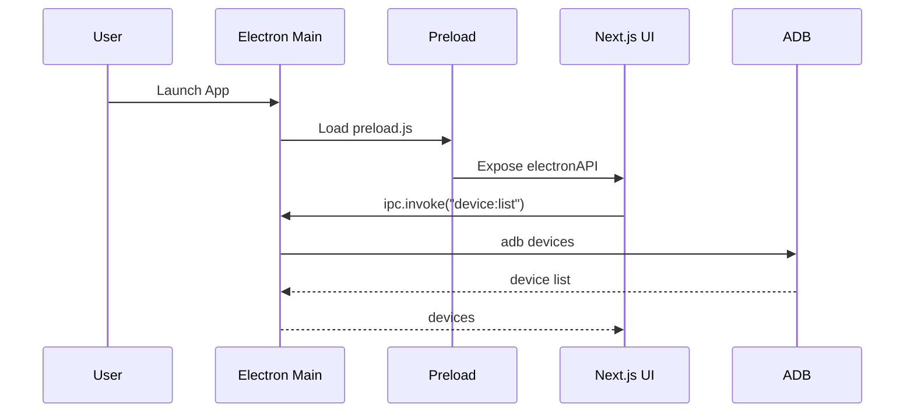
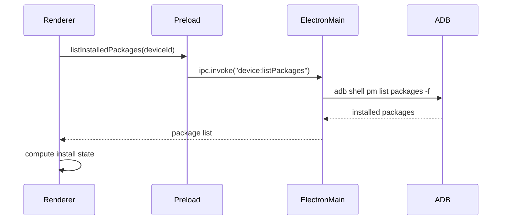
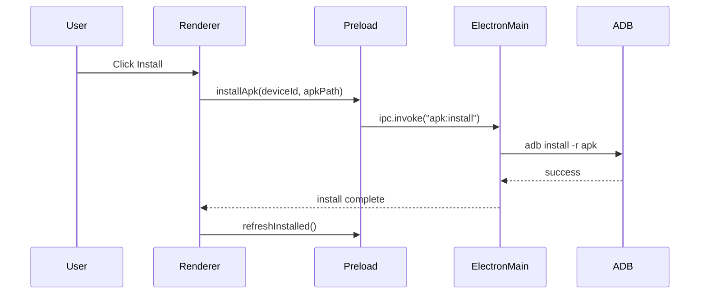
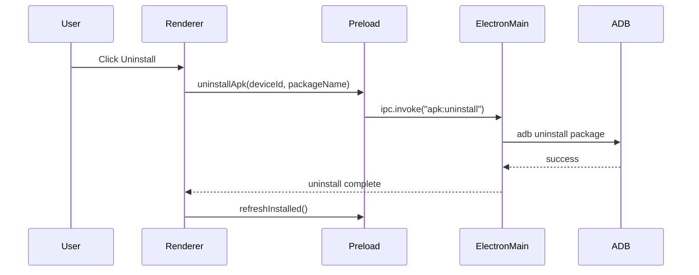
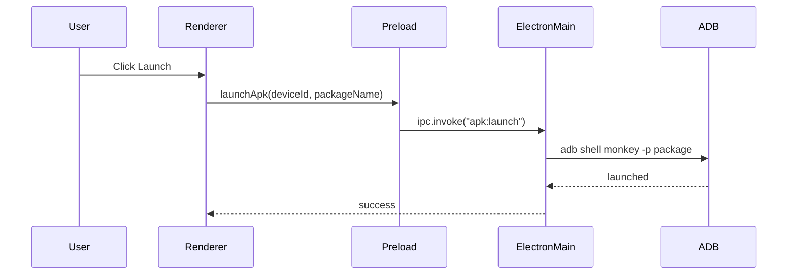
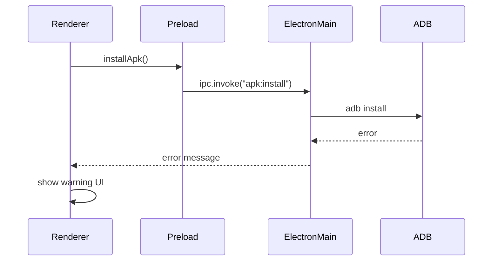
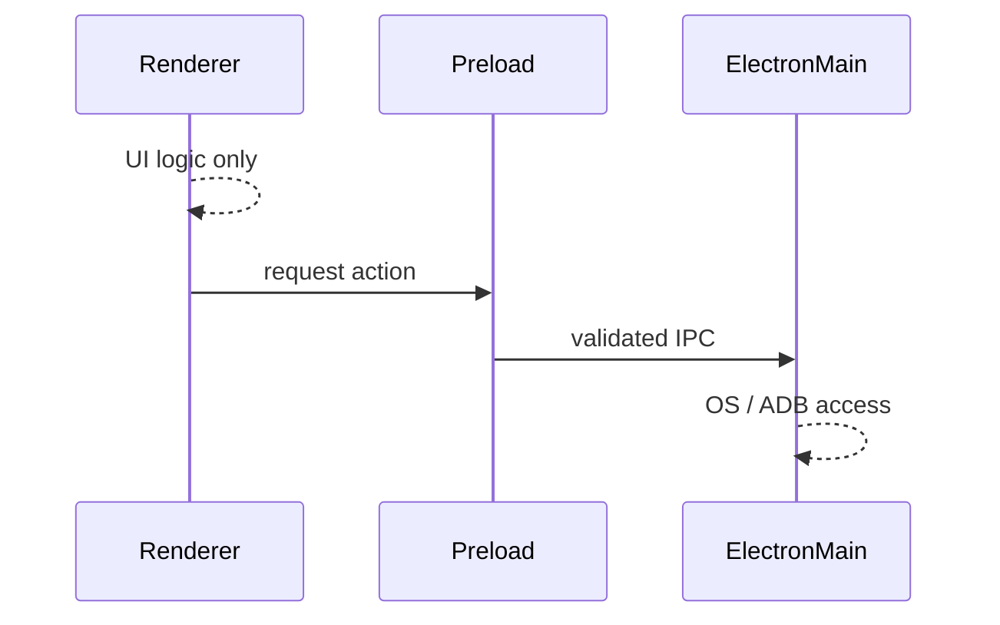
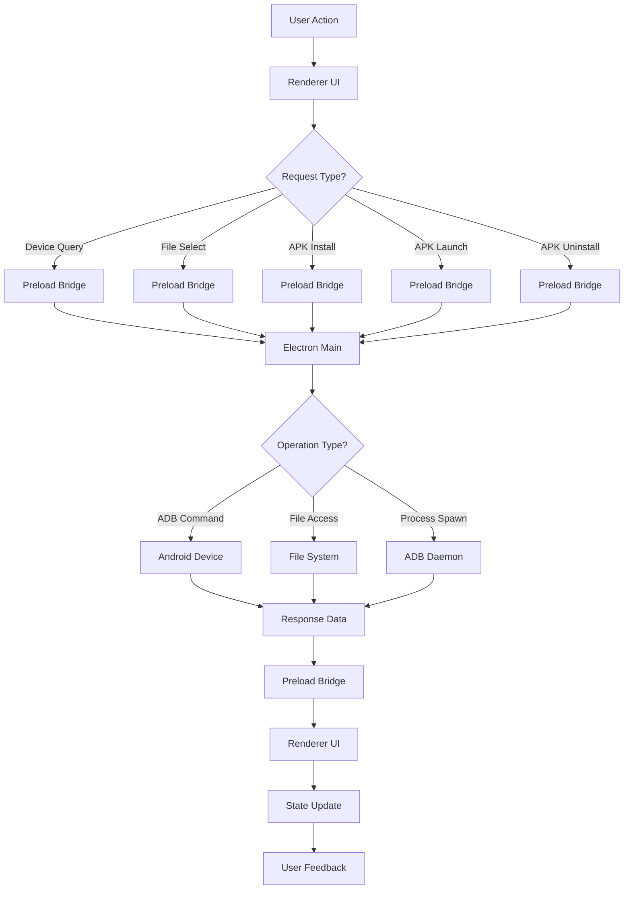

# ADB Desktop Tool

A cross-platform desktop application for managing Android devices using ADB.

## Features
- Device detection
- APK metadata parsing
- Install / Uninstall / Launch apps
- Device install state sync
- (Planned) Logcat viewer

## Tech Stack
- Electron
- Next.js (App Router)
- TypeScript
- pnpm

## Development
```bash
pnpm install
pnpm --filter @adb/electron dev
```


- # 🧠 ADB Desktop Tool
  - Architecture & Runtime Sequence Diagrams
  - 🚀 Purpose of this document
  - This document explains how the ADB Desktop Tool works 
  - internally from application startup to APK
  - installation, launch, error handling, and strict 
  - security boundaries between UI and system-level 
  - operations.

# ADB Desktop Tool - Complete Architecture Documentation

## 📋 Table of Contents
1. [Overview](#overview)
2. [Architecture Layers](#architecture-layers)
3. [Runtime Sequences](#runtime-sequences)
4. [Security Model](#security-model)
5. [Error Handling](#error-handling)
6. [Design Principles](#design-principles)
7. [Data Flow](#data-flow)
8. [API Reference](#api-reference)
9. [Deployment](#deployment)
10. [Troubleshooting](#troubleshooting)

---

## 🎯 Overview

### Purpose
The ADB Desktop Tool provides a secure, user-friendly interface for managing Android applications via ADB (Android Debug Bridge). It bridges the gap between command-line ADB operations and desktop usability while maintaining strict security boundaries.

### Key Features
- 🔐 **Secure APK management** - Install, uninstall, launch Android applications
- 📱 **Multi-device support** - Manage multiple connected Android devices
- 🛡️ **Security-first design** - Complete isolation between UI and system operations
- ⚡ **Real-time sync** - Device state always reflects actual installation status
- 🎨 **Modern UI** - Built with Next.js and Electron for native desktop experience

---

## 🏗️ Architecture Layers

### System Architecture Diagram
```
┌─────────────────────────────────────────────────────────┐
│                    Next.js UI (Renderer)                 │
│  ┌──────────────────────────────────────────────────┐  │
│  │  • React Components                              │  │
│  │  • State Management                              │  │
│  │  • Zero OS Access                                │  │
│  └──────────────────────────────────────────────────┘  │
│                    ↑ ↓ IPC via electronAPI              │
└─────────────────────────────────────────────────────────┘
                           │
┌─────────────────────────────────────────────────────────┐
│                 Preload Layer (Bridge)                  │
│  ┌──────────────────────────────────────────────────┐  │
│  │  • Exposes limited API                          │  │
│  │  • Validates all requests                       │  │
│  │  • Security boundary                            │  │
│  └──────────────────────────────────────────────────┘  │
│                    ↑ ↓ IPC Communication                │
└─────────────────────────────────────────────────────────┘
                           │
┌─────────────────────────────────────────────────────────┐
│               Electron Main Process                     │
│  ┌──────────────────────────────────────────────────┐  │
│  │  • ADB Execution                                │  │
│  │  • File System Access                          │  │
│  │  • Native Dialogs                              │  │
│  │  • Process Management                          │  │
│  └──────────────────────────────────────────────────┘  │
│                    ↑ ↓ ADB Commands                     │
└─────────────────────────────────────────────────────────┘
                           │
                    ┌──────────────┐
                    │ Android Device│
                    │ (Source Truth)│
                    └──────────────┘
```

### Layer Details

#### 🖥️ **Electron Main Process**
- **Responsibilities**:
  - ADB command execution
  - File system operations
  - Native OS dialog management
  - Process spawning and management
  - Final authority for device state
  
- **Access Level**: Full system access
- **Technology**: Node.js with Electron APIs

#### 🔐 **Preload Layer (Bridge)**
- **Responsibilities**:
  - Secure IPC bridge between Main and Renderer
  - Exposes only safe, validated APIs
  - Prevents privilege escalation
  - Type safety enforcement
  
- **Access Level**: Controlled API exposure
- **Technology**: Electron preload scripts

#### 🎨 **Renderer Process (Next.js UI)**
- **Responsibilities**:
  - User interface rendering
  - State visualization and management
  - User interaction handling
  - Error display and user feedback
  
- **Access Level**: Zero system access
- **Technology**: Next.js, React, Tailwind CSS

#### 📱 **Android Device**
- **Role**: Single source of truth for all operations
- **Communication**: ADB protocol
- **State Management**: Always queried, never assumed

---

## 🔄 Runtime Sequences

### 1️⃣ Application Startup Flow


### Purpose
 > ✅ Validates ADB availability

 > ✅ Populates device selector

 > ✅ Confirms IPC wiring

 # 2️⃣ APK Intake & Metadata Parsing

 ```mermaid
 sequenceDiagram
    participant User
    participant Renderer
    participant Preload
    participant ElectronMain
    participant FileSystem
    participant APKParser

    User->>Renderer: Click "Add APK"
    Renderer->>Preload: selectApks()
    Preload->>ElectronMain: ipc.invoke("apk:select")
    ElectronMain->>FileSystem: showOpenDialog
    FileSystem-->>ElectronMain: APK paths
    ElectronMain->>APKParser: parse APK manifest
    APKParser-->>ElectronMain: package, version, icon
    ElectronMain-->>Renderer: APK metadata
```

### Purpose
  > ✅ Native file access

  > ✅ Manifest parsing

  > ❌ No renderer filesystem access

# 3️⃣ Device Install State Sync (Milestone 3A)



### Purpose
  > ✅ Device is the source of truth
  > ✅ UI reflects real state
  > ❌ No assumptions

# 4️⃣ APK Install Flow



### Purpose
  > 🔄 UI re-syncs device state
  > 🚫 Never trusts install command blindly
  > ✅ Always verifies with device

  # 5️⃣ APK Uninstall Flow




# 6️⃣ APK Launch Flow



# 7️⃣ Error Handling Flow (ADB Failure)



# 8️⃣ Security Boundary Diagram (Conceptual)



# 🔒 Security Rules & Boundaries

  # 🚫 Renderer Process Restrictions
  The Renderer process (Next.js UI) has ZERO access to:

    - ❌ ADB execution - Cannot run any ADB commands directly

    - ❌ File system - Cannot read or write files

    - ❌ Process spawning - Cannot create child processes

    - ❌ APK parsing - Cannot analyze APK files directly

    - ❌ System settings - Cannot modify OS configurations

    - ❌ Network sockets - Cannot open raw network connections

    - ❌ Environment variables - Cannot access sensitive system env vars


  # ✅ Electron Main Process ONLY:

  The Main process has FULL responsibility for:

    - ✅ ADB command execution - All ADB operations

    - ✅ File operations - APK reading, temporary file management

    - ✅ Process management - Spawning and monitoring ADB processes

    - ✅ APK parsing - Extracting metadata from APK files

    - ✅ Native dialogs - File picker, error dialogs, system notifications

    - ✅ Device communication - USB debugging protocol handling

  # 🔐 Preload Layer Responsibilities:

    - 🔒 Validates IPC messages
    - 🔒 Exposes limited, safe APIs
    - 🔒 Prevents privilege escalation
    - 🔒 Ensures type safety
    - 🔒 API Filtering: Exposes only approved methods to Renderer
    - 🔒 Input Validation: Validates all parameters before forwarding
    - 🔒 Type Safety: Enforces TypeScript interfaces for all IPC
    - 🔒 Error Sanitization: Removes sensitive data from error messages
    - 🔒 Rate Limiting: Prevents abuse of system calls

# ⚠️ Error Handling

  # Error Categories
    1. ADB Connection Errors
      Symptoms: Device not found, connection refused
      Handling:
      Show clear error message with troubleshooting steps
      Auto-retry with exponential backoff
      Provide "Refresh Devices" button

    2. APK File Errors
      Symptoms: Invalid APK, corrupted file, missing permissions
      Handling:
      Validate APK before installation attempt
      Show file validation errors
      Suggest re-downloading the APK

    3. Installation Errors
      Symptoms: Insufficient storage, version conflicts, signature issues
      Handling:
      Parse ADB error output for meaningful messages
      Suggest specific fixes (clear storage, uninstall previous version)
      Provide detailed logs for debugging

    4. Permission Errors
      Symptoms: USB debugging disabled, insufficient permissions
      Handling:
      Guide user through enabling developer options
      Provide platform-specific troubleshooting
      Check ADB daemon status
  # Error Recovery Strategies
      Graceful Degradation: Fall back to basic functionality when features fail
      State Preservation: Maintain UI state during retry operations
      User Guidance: Provide actionable steps for common errors
      Automatic Recovery: Attempt to reconnect/recover without user intervention

# 🎯 Design Principles

  ## Principle 
    - Separation of Concerns
    - Single Source of Truth
    - Defensive Programming
    - Minimal Privilege
    - Explicit Communication

  ## Implementation
    - UI vs. System operations
    - Device state always queried
    - All operations verified
    - Renderer has zero OS access
    - Strict IPC with validation

  ## Benefit
    - Security & Maintainability
    - Reliability
    - Error resilience
    - Security
    - Predictability

# Architectural Decisions
  # Electron + Next.js Choice:
  Why: Combines native desktop capabilities with modern web UX
     Benefit: Single codebase for cross-platform deployment

  # Three-Layer Architecture:
    Why: Clear security boundaries between UI and system
    Benefit: Prevents privilege escalation attacks

  # Device as Truth:
  Why: Always query actual device state
    Benefit: Eliminates sync issues and false states
    
  # Sync-After-Action:
  Why: Verify every operation with device query
    Benefit: Guarantees UI reflects actual state


# 📊 Data Flow Summary



# State Management Flow
  - User initiates action → UI updates optimistically

  - Request sent to Main process → Via secure IPC

  - Main executes operation → ADB/file system interaction

  - Response returned → Success/error data

  - UI syncs with device → Always verify actual state

  - Visual feedback → Update UI based on real device state

# 🔧 API Reference

  Preload Layer API (Exposed to Renderer)
  # Device Management
```
  interface DeviceAPI {
    // List connected devices
    listDevices(): Promise<Device[]>;
    
    // Get device details
    getDeviceInfo(deviceId: string): Promise<DeviceInfo>;
    
    // List installed packages
    listInstalledPackages(deviceId: string): Promise<Package[]>;
    
    // Check package status
    isPackageInstalled(deviceId: string, packageName: string): Promise<boolean>;
  }
```
  # APK Management
```
  interface APKAPI {
    // Select APK files
    selectApks(): Promise<APKFile[]>;
    
    // Install APK to device
    installApk(deviceId: string, apkPath: string): Promise<InstallResult>;
    
    // Uninstall package
    uninstallApk(deviceId: string, packageName: string): Promise<UninstallResult>;
    
    // Launch application
    launchApk(deviceId: string, packageName: string): Promise<LaunchResult>;
    
    // Extract APK metadata
    getApkMetadata(apkPath: string): Promise<APKMetadata>;
  }
```

  # System Operations
```
  interface SystemAPI {
    // Check ADB availability
    checkAdb(): Promise<boolean>;
    
    // Get application version
    getAppVersion(): Promise<string>;
    
    // Open logs directory
    openLogsDirectory(): Promise<void>;
    
    // Restart ADB daemon
    restartAdb(): Promise<boolean>;
  }
```

# 🚀 Deployment

```
  # Development
  npm run dev            # Start Next.js dev server
  npm run electron:dev   # Start Electron with dev server

  # Production Build
  npm run build          # Build Next.js application
  npm run electron:build # Package Electron app

  # Platform-specific builds
  npm run build:win      # Windows build
  npm run build:mac      # macOS build
  npm run build:linux    # Linux build
```

# Directory Structure

```
  adb-desktop-tool/
  ├── src/
  │   ├── main/          # Electron main process
  │   │   ├── ipc/       # IPC handlers
  │   │   ├── adb/       # ADB operations
  │   │   ├── files/     # File operations
  │   │   └── main.ts    # Main entry point
  │   │
  │   ├── preload/       # Preload scripts
  │   │   └── preload.ts # Bridge between main/renderer
  │   │
  │   └── renderer/      # Next.js application
  │       ├── app/       # App router pages
  │       ├── components/# React components
  │       ├── lib/       # Utilities and hooks
  │       └── styles/    # CSS/Tailwind styles
  │
  ├── public/            # Static assets
  ├── dist/              # Built application
  ├── resources/         # App resources (icons, etc.)
  └── package.json       # Dependencies and scripts
```

# Dependencies

```
  {
    "dependencies": {
      "next": "^14.0.0",
      "react": "^18.2.0",
      "react-dom": "^18.2.0",
      "electron": "^25.0.0",
      "tailwindcss": "^3.3.0",
      "adb-ts": "^2.0.0",      // ADB TypeScript client
      "apk-parser3": "^0.3.0", // APK metadata extraction
      "electron-store": "^8.1.0" // Persistent storage
    },
    "devDependencies": {
      "@types/node": "^20.0.0",
      "typescript": "^5.0.0",
      "electron-builder": "^24.0.0"
    }
  }
```

# 🔍 Troubleshooting

```
Common Issues
1. "No Devices Found"
  Possible causes:

  USB debugging not enabled

  ADB daemon not running

  Device not authorized

  USB cable/connection issue

  Solutions:

  Enable Developer Options on Android device

  Enable USB debugging

  Check "Always allow from this computer"

  Restart ADB daemon: adb kill-server && adb start-server

  Try different USB cable/port

2. "APK Installation Failed"
  Possible causes:

  Insufficient storage space

  Version conflict with existing app

  Signature mismatch

  Corrupted APK file

  Solutions:

  Check available storage on device

  Uninstall previous version first

  Enable "Install unknown apps" permission

  Verify APK integrity (re-download if needed)

3. "Application Crashes on Startup"
  Possible causes:

  Missing dependencies

  ADB not in system PATH

  Permission issues

  Conflicting software

  Solutions:

  Ensure ADB is installed and in PATH

  Run as administrator/root if needed

  Check antivirus/firewall settings

  View application logs for details

Debug Mode
  # Set environment variable
  export ADB_TOOL_DEBUG=true

  # Or start with flag
  npm start -- --debug
```
# Logging

  - Renderer logs: Browser DevTools (F12)
  - Main process logs: System console or log file
  - ADB logs: adb logcat for device-side issues
  - Application logs: Located in app data directory

# 🏆 Key Takeaways
  - Security First - Complete isolation between UI and system operations

  - Device as Truth - All install states verified against actual device

  - Predictable Flow - Clear sequence for every operation

  - Error Resilient - Graceful handling of ADB failures

  - Maintainable - Clean separation enables easy updates

# 📝 Version History

```
v1.0.0 (Current)
  Initial release with core functionality

  Secure three-layer architecture

  Multi-device support

  APK install/uninstall/launch

  Real-time device state sync

Planned Features
  v1.1.0: Batch operations, drag-drop support

  v1.2.0: Screenshot capture, file transfer

  v1.3.0: Plugin system, advanced debugging tools

  v2.0.0: Cloud sync, team collaboration features
```
# 📄 License
MIT License - See LICENSE file for details

🤝 Contributing
See CONTRIBUTING.md for development guidelines

🐛 Bug Reports
Use GitHub Issues with detailed reproduction steps

Documentation Version: 1.0.0
Last Updated: 18-12-2025
Architecture Version: 1.0
